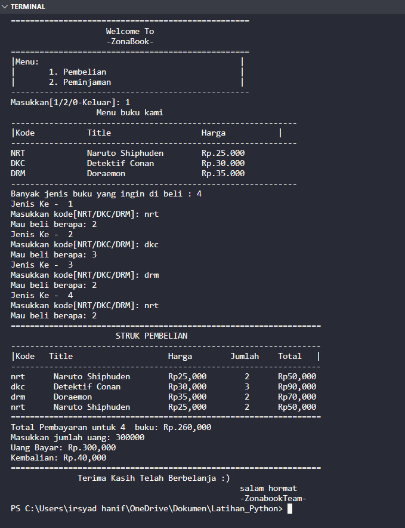
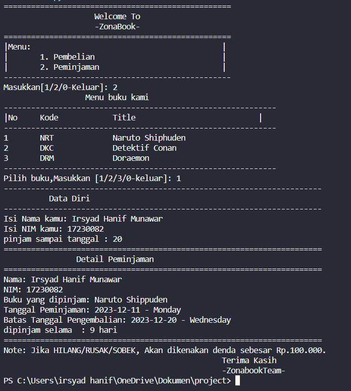

# Zona Book

Tugas Project Semester 1 - Kelompok 6




---

## Deskripsi
project ini dibuat dengan tema pembelian/penjualan buku di sebuah toko. &
Project ini dibuat secara berkelompok 🤩 sebagai bagian dari tugas semester 1. Proyek menggunakan Bahasa Python dan menerapkan konsep Nested if serta menggunakan modul datetime bawaan Python.

---

## Anggota Kelompok

Kelompok 6:
- Irsyad Hanif Munawar
- Muhamad Haidar
- Hafidz Rahadianto
- Muhamad Mauladi
- Azrial Zakri Khilibi

---

## Fitur Utama

- Penggunaan Nested if
- Pemanfaatan modul datetime bawaan Python
- Pembelian dan Peminjaman agar mempermudah transaksi

---
Create by Irsyad Hanif with Myfriend ©2023

## Cara Menggunakan

1. Clone repositori ini.
   ```bash
   git clone https://github.com/IrsyadHaniff/tugasProject-smt1.git
